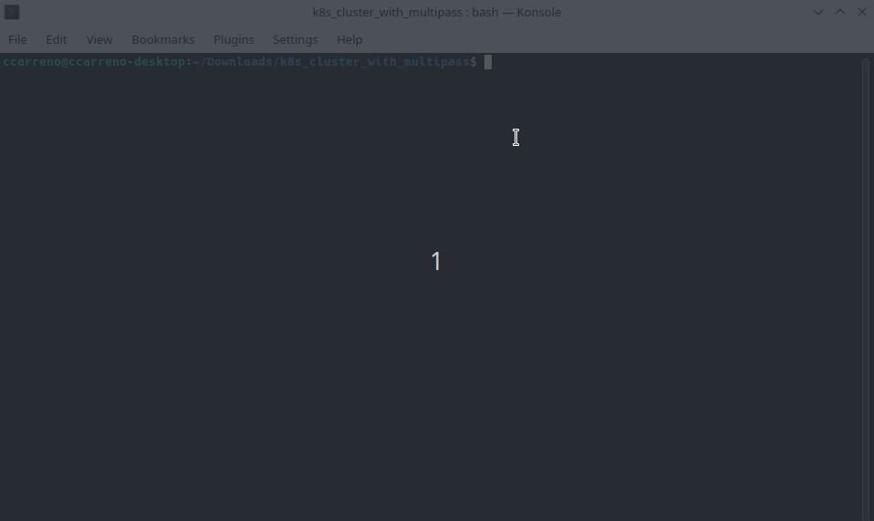
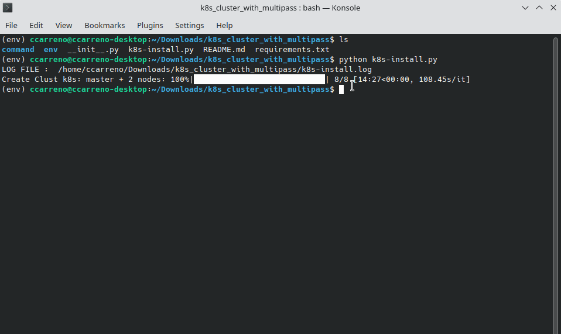
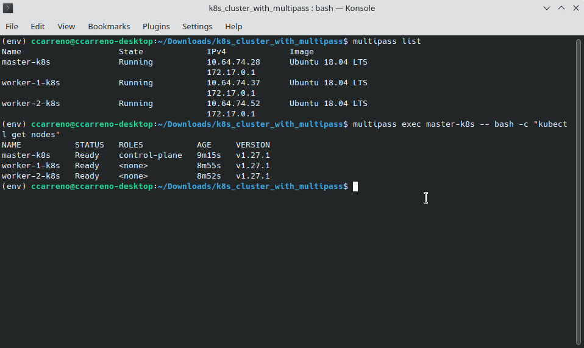

# CREATE k8s CLUSTER WITH MULTIPASS VM


**CREATE VIRTUAL ENVIRONMENT**
```shell
virtualenv env
```

**LOAD VIRTUAL ENVIRONMENT**
```shell
source env/bin/activate
```

**INSTALL DEPENDENCY IN VIRTUAL ENVIRONMENT**
```shell
pip install -r requirements.txt
```

**RUN APP**
```shell
python k8s-install.py
```



**VERIFIED EXECUTION**

Forms 1.



Forms 2.

