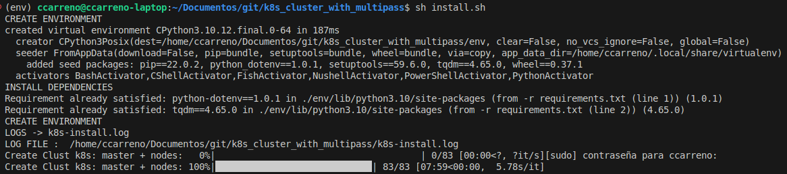
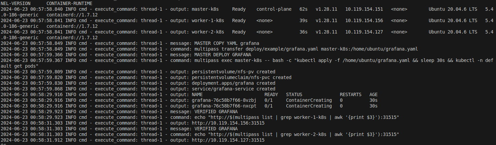
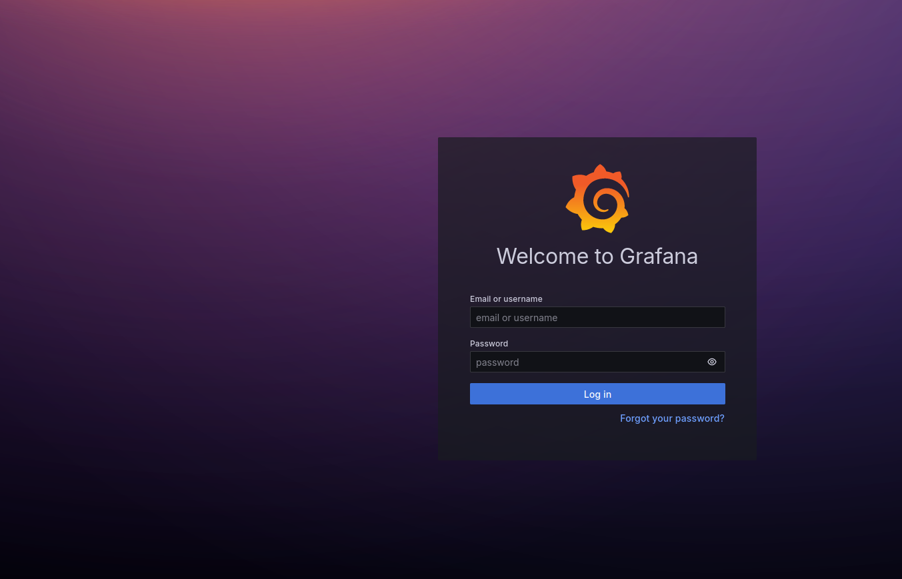

# CREATE k8s CLUSTER WITH MULTIPASS VM

Install command:


```shell
chmod +x install.sh
sh install.sh
```



**VERIFIED EXECUTION**





## INSTALL KUBECTL 

```shell
curl -LO "https://dl.k8s.io/release/$(curl -L -s https://dl.k8s.io/release/stable.txt)/bin/linux/amd64/kubectl"
curl -LO "https://dl.k8s.io/release/$(curl -L -s https://dl.k8s.io/release/stable.txt)/bin/linux/amd64/kubectl.sha256"
echo "$(cat kubectl.sha256)  kubectl" | sha256sum --check

sudo install -o root -g root -m 0755 kubectl /usr/local/bin/kubectl
```


## CONFIGURATION LOCAL KUBECONFIG

```shell
echo -e "$(multipass exec master-k8s -- cat /home/ubuntu/.kube/config)" > $HOME/.kube/config
```